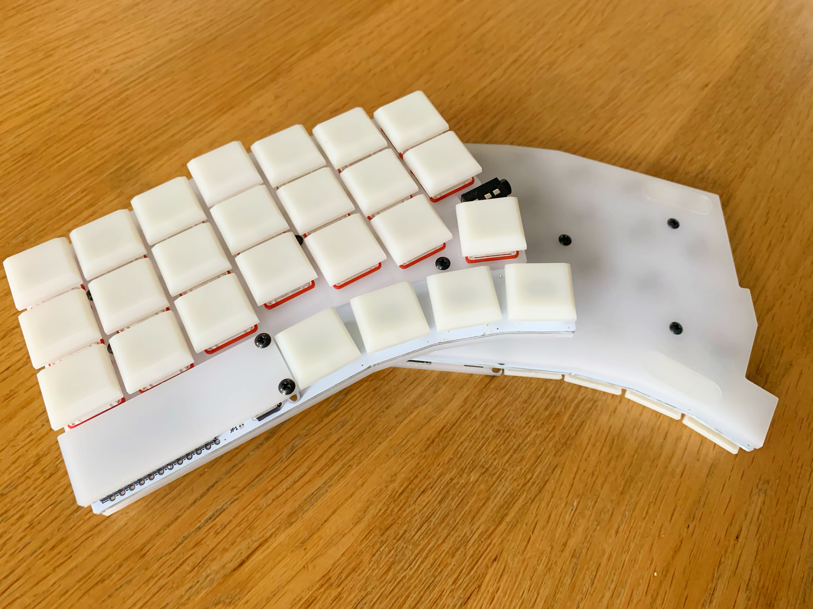
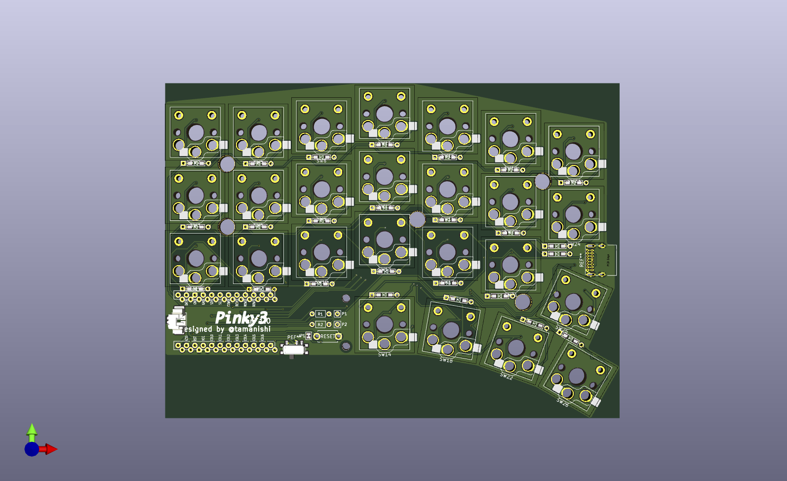
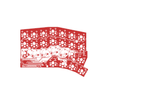
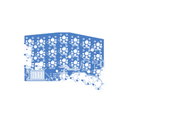
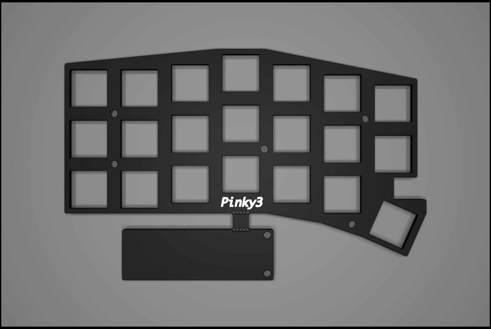
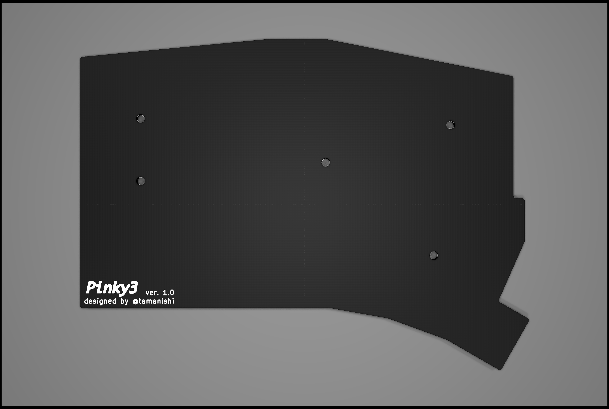
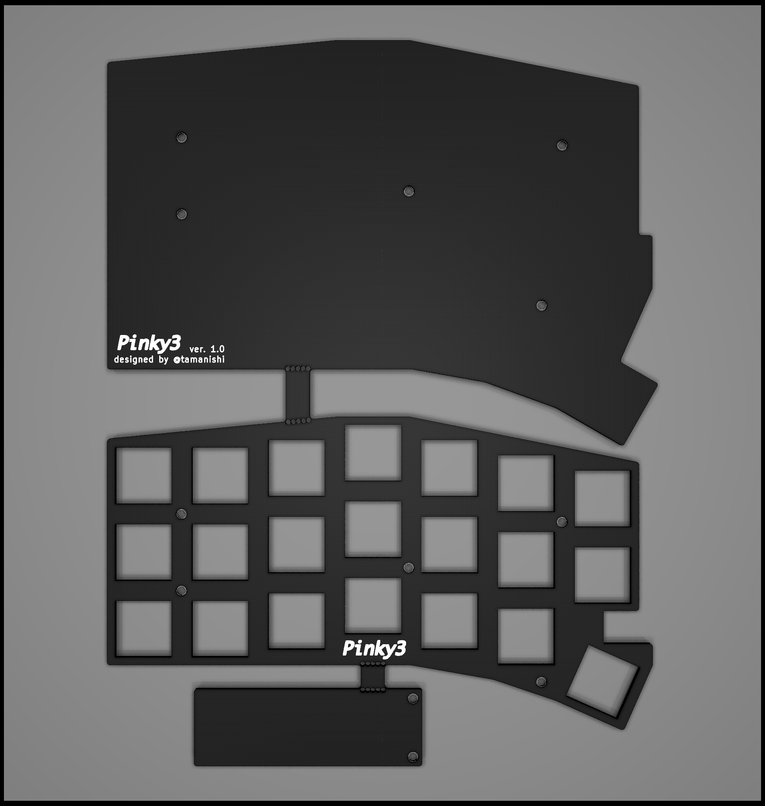

# Pinky3

> **Warning**  
> If you are using Kicad 6, please see https://github.com/tamanishi/Pinky4/issues/4 .

> Not tested yet. Building in progress.

Fully wireless capable/ wired split keyboard based on [Pinky3](https://github.com/tamanishi/Pinky3) but with Kailh low profile V1 switches and usb type-c receptables instead of TRRS for maximum portability- ~~not that I forgot to check branches on original projects.~~

A split 3 x 7 vertically staggered keys and 4 thumb keys keyboard.  
An idea is inspired from [crkbd](https://github.com/foostan/crkbd), [Lily58](https://github.com/kata0510/Lily58), [Ergo42](https://github.com/Biacco42/Ergo42) and [Helix](https://github.com/MakotoKurauchi/helix).  

## Pcb & Plates

<!--  -->

## Bill of Materials (for both hands)

| # | name | qty |
| ---: | :--- | ---: |
| 1 | pcbs | 2 |
| 2 | top plates | 2 |
| 3 | bottom plates | 2 |
| 4 | nice!nano (or equivalent) | 2 |
| 5 | Conthrough for Pro Micros | 4 |
| 6 | 2 pins tact switches | 2 |
| 7 | USB 4085 female receptables | 2 |
| 8 | diodes (1N4148 or 1N4148W) | 50 |
| 10 | Kailh Hotswap Sockets (Choc Sockets) | 8 |
| 12 | Kailh low profile (Choc) V1 keyswitches | 8 |
| 14 | Kailh low profile (Choc) V1 compatible keycaps | 8 |
| 15 | USb Type-C to Type-C cable (optional) | 1 |
| 16 | 12mm M2 standoffs (for top and bottom plates) **(should be adapted to battery thickness)** | 10 |
| 17 | 5.5mm M2 standoffs (for Pro Micro cover plates) | 4 |
| 18 | 4mm M2 screws | 28 |
| 19 | rubber cushions | 8 |
| 20 | Li-po Battery with RB type connector(gnd on the right side) | 2 |
| 21 | Molex 53261-0271 | 2 |
| 22 | Molex 51021-02 | 2 |
| 23 | [Sparkfun Surface Mount Right Angle Switch](https://www.sparkfun.com/products/10860) | 2 |

## Firmware

See [ZMK](https://zmk.dev)
